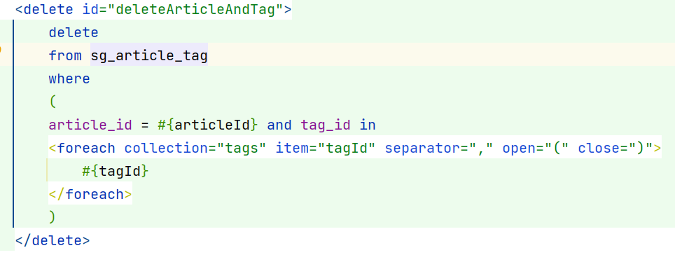

# 个人博客

```text
心得：
    1、了解基本包结构 
        controller （处理前端发来的请求和回传的响应）
        service （前端具体的业务在这个包下实现）
        mapper （(dao)持久层开发，与数据库进行交互）
        entity （实体类，模型的对象化）
        config （配置类，相关框架的配置可以通过@Configuration标识 并且实现或者继承）
        vo (封装从后台传入前台的数据)
        dto (封装从前台传入后台的数据)
        exception （自定义的全局异常处理）
        constants （常量类，将字面量写在这里面）
    2、熟悉了一些项目的开发流程；
    3、学习一些设计思想；
    4、将先前所学的知识应用起来

```

## 分析业务
```text
    分为前后台， 因此考虑分成多个模块实现,同时对于相同的业务获取工具类配置类，采用
    一个公共的框架管理，减少重复代码量，同样的因为多模块的问题，通过maven管理的依赖
    变得冗余了，有可能也会因为版本不兼容而产生冲突，所以可以利用Maven的继承机制对需
    要的依赖进行版本控制统一管理。
    
    前台页面
        1、首页
        2、分类
        3、友链
        4、个人中心（这里需要用户登录才能访问）
    
    后台页面
        1、首页
        2、发表博文
        3、系统管理
        4、用户管理
```
> 前台模块 <font color='red'>zhu-blog</font>
> > 可以让任何人不用登录进行访问，但是如果访客想要评论就需要进行登录操作（普通用户）<br />
    此时登录可以通过Security + Jwt权限认证既能够保存用户的信息安全，而且能够让用户<br />
    在之后的一段时间内免登录。之后进行一个普通的CRUD；中间具体按照MVC的模式进行业务开发<br />
    同时为了简化持久层的开发，引入了mybatis持久层框架，简化持久层的开发。
    
> 
> 后台模块 <font color='red'>zhu-admin</font>
> > 只有拥有管理员权限的用户能够进入，必须登录

## 1、博客前台
### 一些常用类
#### 前后端数据统一类
```java
package com.zhu.blog.entity;

import com.fasterxml.jackson.annotation.JsonInclude;
import com.zhu.blog.enums.AppHttpCodeEnum;

/**
 * @author GH
 * @Description: 前后端数据交换格式统一
 * @date 2023/2/16 16:13
 */
@JsonInclude(JsonInclude.Include.NON_NULL)
@SuppressWarnings("unchecked")
public class ResponseResult<T>{

    private Integer code;
    private String msg;
    private T data;


    public ResponseResult() {
        this.code = AppHttpCodeEnum.SUCCESS.getCode();
        this.msg = AppHttpCodeEnum.SUCCESS.getMsg();
    }

    public ResponseResult(Integer code, T data) {
        this.code = code;
        this.data = data;
    }

    public ResponseResult(Integer code, String msg, T data) {
        this.code = code;
        this.msg = msg;
        this.data = data;
    }

    public ResponseResult(Integer code, String msg) {
        this.code = code;
        this.msg = msg;
    }

    public static ResponseResult errorResult(int code, String msg) {
        ResponseResult result = new ResponseResult();
        return result.error(code, msg);
    }
    public static ResponseResult okResult() {
        ResponseResult result = new ResponseResult();
        return result;
    }
    public static ResponseResult okResult(int code, String msg) {
        ResponseResult result = new ResponseResult();
        return result.ok(code, null, msg);
    }

    public static ResponseResult okResult(Object data) {
        ResponseResult result = setAppHttpCodeEnum(AppHttpCodeEnum.SUCCESS, AppHttpCodeEnum.SUCCESS.getMsg());
        if(data!=null) {
            result.setData(data);
        }
        return result;
    }

    public static ResponseResult errorResult(AppHttpCodeEnum enums){
        return setAppHttpCodeEnum(enums,enums.getMsg());
    }

    public static ResponseResult errorResult(AppHttpCodeEnum enums, String msg){
        return setAppHttpCodeEnum(enums,msg);
    }

    public static ResponseResult setAppHttpCodeEnum(AppHttpCodeEnum enums){
        return okResult(enums.getCode(),enums.getMsg());
    }

    private static ResponseResult setAppHttpCodeEnum(AppHttpCodeEnum enums, String msg){
        return okResult(enums.getCode(),msg);
    }

    public ResponseResult<?> error(Integer code, String msg) {
        this.code = code;
        this.msg = msg;
        return this;
    }

    public ResponseResult<?> ok(Integer code, T data) {
        this.code = code;
        this.data = data;
        return this;
    }

    public ResponseResult<?> ok(Integer code, T data, String msg) {
        this.code = code;
        this.data = data;
        this.msg = msg;
        return this;
    }

    public ResponseResult<?> ok(T data) {
        this.data = data;
        return this;
    }

    public Integer getCode() {
        return code;
    }

    public void setCode(Integer code) {
        this.code = code;
    }

    public String getMsg() {
        return msg;
    }

    public void setMsg(String msg) {
        this.msg = msg;
    }

    public T getData() {
        return data;
    }

    public void setData(T data) {
        this.data = data;
    }


}

```
#### security权限认证的的配置类
```java
package com.zhu.blog.config;

/**
 * @author GH
 * @Description:
 * @date 2023/3/3 20:04
 */
@Configuration
public class SecurityConfig extends WebSecurityConfigurerAdapter {

    @Autowired
    private JwtAuthenticationTokenFilter jwtAuthenticationTokenFilter;

    @Autowired
    private AuthenticationEntryPoint authenticationEntryPoint;

    @Autowired
    private AccessDeniedHandler accessDeniedHandler;

    /**
     * 用户密码加密类型
     *
     * @return
     */
    @Bean
    public PasswordEncoder passwordEncoder() {
        return new BCryptPasswordEncoder();
    }

    /**
     * 解决跨域请求问题
     *
     * @param http
     * @throws Exception
     */
    @Override
    protected void configure(HttpSecurity http) throws Exception {
        http
                //关闭csrf
                .csrf().disable()
                //不通过Session获取SecurityContext
                .sessionManagement().sessionCreationPolicy(SessionCreationPolicy.STATELESS)
                .and()
                .authorizeRequests()
                // 对于登录接口 允许匿名访问
                .antMatchers("/login").anonymous()
                .antMatchers("/logout").authenticated()
                .antMatchers("/user/userInfo").authenticated()
                // 除上面外的所有请求全部不需要认证即可访问
                .anyRequest().permitAll();

        // 配置异常处理器
        http.exceptionHandling()
                .authenticationEntryPoint(authenticationEntryPoint)
                .accessDeniedHandler(accessDeniedHandler);

        // 关闭默认的退出登录功能
        http.logout().disable();

        http.addFilterBefore(jwtAuthenticationTokenFilter, UsernamePasswordAuthenticationFilter.class);
        //允许跨域
        http.cors();
    }

    /**
     * security权限校验
     *
     * @return
     * @throws Exception
     */
    @Override
    @Bean
    public AuthenticationManager authenticationManagerBean() throws Exception {
        return super.authenticationManagerBean();
    }
}
```

### 遇到的问题
<font color="red">逻辑问题</font>
> 在文章实体类中有几个字段设置了自动填充，
> 但是填充的过程中需要拿到当前登录的用户id，
> 而前台开发中实现了一个redis缓存浏览量；在这一段过程中
> 设置了一个定时任务，每隔一定时间更新一次，这是就会不断
> 地更新数据库中的几个字段，而此时又没有用户登录，从而导致了空指针异常

<font color="red">表设计问题1</font>
> 文章和标签进行了关联，同时增加了一张表存储它们的关系，将两个值都设置为主键
> 所以在进行持久层操作的时候都无法将其删除或者更新
> <br />通过以下方式解决
> 


<font color="red">表设计问题2</font>
> 对于角色用户表，其中保存了角色用户关联关系，而在进行角色信息删除时也会影响到这张表
> 后期再解决


<font color="red">联合前端问题</font>
> 后台的菜单管理中对于新增菜单
> 对于没有跟前端做好统一因此如果添加了目录后，会影响页面的展示问题
> 因此对于菜单管理，不要进行增删操作